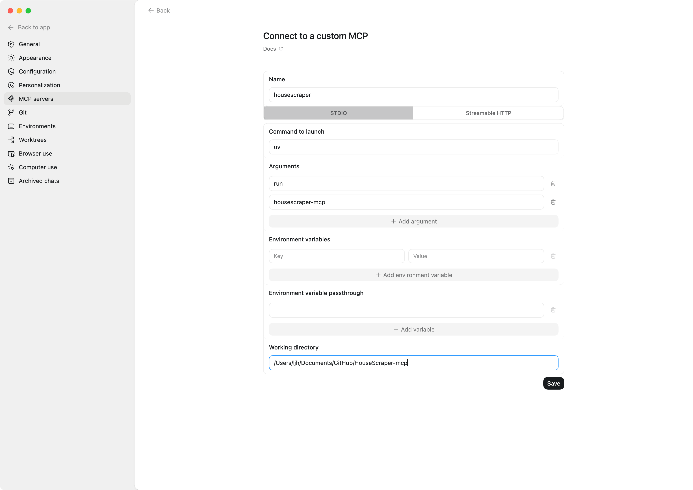

# HouseScraper MCP

一个本地运行的 MCP 服务，用于聚合检索房源，支持 `beike`、`lianjia`、`anjuke`。


## 环境准备

要求：

- Python `3.12`
- `uv`

获取代码（首次）：

```bash
git clone <YOUR_REPO_URL> /Users/ljh/Documents/GitHub/HouseScraper-mcp
cd /Users/ljh/Documents/GitHub/HouseScraper-mcp
```

初始化依赖：

```bash
cd /Users/ljh/Documents/GitHub/HouseScraper-mcp
uv sync --python 3.12
```

## 启动服务


直接启动：

```bash
cd /Users/ljh/Documents/GitHub/HouseScraper-mcp
uv run housescraper-mcp
```

启动后它会等待 MCP 客户端通过标准输入输出连接，不会自己打印交互界面。


### 在 Codex Desktop 中注册



最少配置：

- `Name`: `housescraper`
- `STDIO`
- `Command to launch`: `uv`
- `Arguments`: `run`, `housescraper-mcp`
- `Working directory`: `/Users/ljh/Documents/GitHub/HouseScraper-mcp`

点 `Save` 后重开会话即可。

